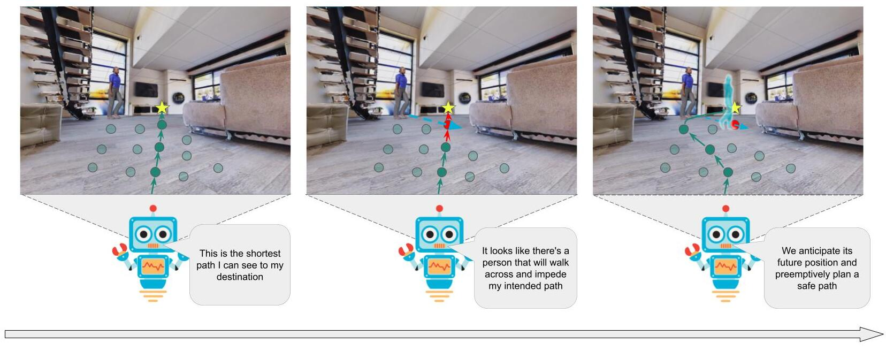
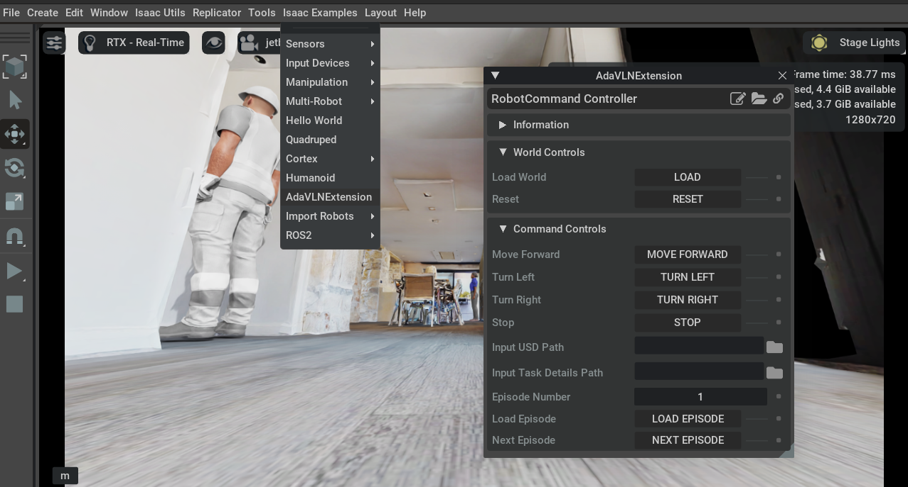

# AdaVLN




<!-- ABOUT THE PROJECT -->
## About The Project


AdaSimulator is an IsaacSim-based simulator extension that provides a physics-enabled platform for studying the Visual Language Navigation problem in a continuous environment with realistic robots and moving human obstacles. It was introduced as part of the "AdaVLN : Towards Visual Language Navigation in Continuous Indoor Environments with Moving Humans" paper.


<!-- GETTING STARTED -->
## Getting Started

The following are the steps required to setup the AdaVLN extension in your Isaac Sim installation.
Instructions for interfacing an agent with the simulator will be provided soon.

### Prerequisites

- [Isaac Sim](https://developer.nvidia.com/isaac-sim)

Install all necessary requirements in your Isaac Sim Python environment
For instance, if you have aliased the IsaacSim installation's python.sh as `isaacpython`

```
isaacpython -m pip install -r requirements.txt
```

### Installation
To install, clone this repository into your local machine and create a symbolic link to your Isaac Sim installation's extension examples folder.

```bash

cd ~
git clone https://github.com/dillonloh/AdaVLN.git
cd AdaVLN

# replace with your path to Isaac Sim installation
# example: /home/dillon/.local/share/ov/pkg/isaac-sim-4.2.0/exts/omni.isaac.examples/omni/isaac/examples
ln -s $(pwd) <path_to_isaac_sim>/exts/omni.isaac.examples/omni/isaac/examples

```

Now add the extension to omni.isaac.example's config file so that IsaacSim will load it on startup.

Open the `<path_to_isaac_sim>/exts/omni.isaac.examples/config/extension.toml` file and add these 2 lines before [[test]]
```bash
[[python.module]]
name = "omni.isaac.examples.AdaVLN"

```

Now, replace the omni.anim.people ext in the Isaac Sim installation with the one provided [here](https://github.com/dillonloh/isaac-sim-people-cycle-sim). We will rename your original extension folder to omni.anim.people.bak and replace it with the new extension folder.


```bash  

cd ~
git clone https://github.com/dillonloh/isaac-sim-people-cycle-sim
cd isaac-sim-people-cycle-sim

# replace with your path to Isaac Sim installation
# example: /home/dillon/.local/share/ov/pkg/isaac-sim-4.2.0/extscache/omni.anim.people-0.5.0/omni/anim/people

mv <path_to_isaac_sim>/extscache/omni.anim.people-0.5.0/omni/anim/people <path_to_isaac_sim>/extscache/omni.anim.people-0.5.0/omni/anim/people.bak

ln -s $(pwd) <path_to_isaac_sim>/extscache/omni.anim.people-0.5.0/omni/anim/people

```

To verify that the installation is successful, open IsaacSim and check if AdaVLN is listed in the Isaac Examples tab from the top toolbar.



<!-- USAGE EXAMPLES -->
## Usage

To setup the example 3D environments, copy and paste the absolute paths of the GLB files in the `example_dataset/merged` folder in this repository into the extension's `Input USD Path` field. In conjunction, copy and paste the absolute path of the `example_dataset/tasks/tasks.json` file in this repository into the `Input Task Details Path` field.

Finally, click on the `Load Episode` button to load the environment with the animated humans into the simulator. This also sets up the navigation task interface on ROS for your agents to receive task details and send commands by.

You can also run the baseline agent provided in the `agent` folder by running the following command in the terminal. Note that you'll need to either link it to your own self-hosted multimodal LLM, or provide an API key to use a hosted one. We have provided code that connects to the OpenAI GPT-4o-mini completions endpoint.


```bash

# Assuming you have isaacpython alias as described above

isaacpython agent/react_agent.py

```

<!-- LICENSE -->
## License

Distributed under the MIT License. See `LICENSE.txt` for more information.

<!-- CITING -->
## CITING
To cite this work, please use the following BibTeX entry:

```
@inproceedings{,
  title={AdaVLN: Towards Visual Language Navigation in Continuous Indoor Environments with Moving Humans},
  author={},
  booktitle={},
  year={},
  organization={},
}
```
